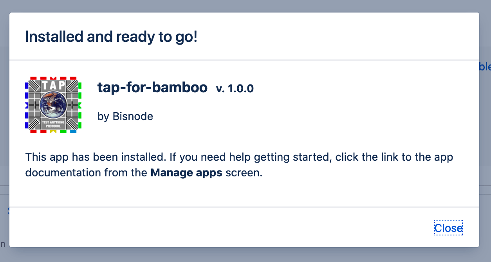

# TAP for Bamboo

Plugin for parsing [TAP (Test Anything Protocol)](https://testanything.org/) test results for inclusion in builds 
reports.

Atlassian used to maintain [a plugin for this](https://bitbucket.org/atlassian/bamboo-tap-plugin/src/master/) but as 
it hasn't been maintained for a few years we needed something that would work with the more recent versions of Bamboo. 

## Installation

Drop the plugin jar in your Bamboo plugins directory, or install it through the Bamboo admin web UI.

## Usage

In your build configuration, add the TAP task and point it to a directory containing *.tap files. These will now be 
parsed and the outcome included in the build reports.

